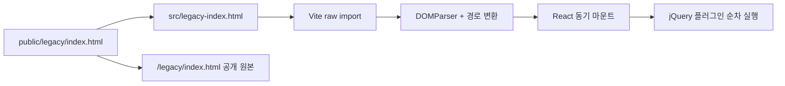

# 원본 디자인을 보존하는 React 아키텍처

이 프로젝트의 목적은 2015년 포트폴리오를 새로 디자인하는 것이 아니라,
원본 화면과 jQuery 인터랙션을 유지하면서 현대적인 설치·빌드·배포 환경을
제공하는 것입니다.

## 해결해야 했던 문제

원본 사이트는 HTML, CSS, jQuery와 여러 정적 작업물이 서로 상대 경로로
연결돼 있습니다. 화면을 React 컴포넌트로 한 번에 다시 작성하면 다음 문제가
생깁니다.

- reset CSS와 브라우저 기본값이 달라져 픽셀 배치가 바뀝니다.
- jQuery 플러그인의 초기화 순서와 DOM 구조가 깨질 수 있습니다.
- 과거 작업물의 상대 이미지·링크 경로가 루트 앱에서 잘못 해석됩니다.
- React 마운트 후 원본 문서를 네트워크로 가져오면 첫 스크롤 입력이
  사라집니다.

## 접근 방식

원본 문서를 빌드에 포함하고 React는 보존 화면을 실행하는 셸 역할만 합니다.

렌더링 순서는 다음과 같습니다.

1. Vite가 `src/legacy-index.html`을 JavaScript 번들에 문자열로 포함합니다.
2. `src/legacy.js`가 원본 `body`를 파싱하고 상대 경로를 `/legacy` 기준으로
   변환합니다.
3. `src/main.jsx`가 브라우저 `load` 전에 `flushSync`로 React를 마운트합니다.
4. `src/App.jsx`가 jQuery, scrollTo, Magnific Popup과 원본 스크립트를 순서대로
   실행합니다.

세부 인터페이스는 [기술 참조](REFERENCE.md)를 참고하세요.

## 설계 결정

### 원본 HTML을 raw import로 포함

**문제:** 원본 HTML을 런타임 `fetch`로 읽으면 네트워크가 느린 운영 환경에서
`load` 직후 문서 높이가 한 화면뿐입니다. 사용자가 바로 스크롤하면 입력이
무시됩니다.

**선택:** 빌드용 미러 `src/legacy-index.html`을 Vite `?raw` import로 번들에
포함합니다. 별도 네트워크 왕복 없이 첫 렌더에서 전체 섹션이 존재합니다.

**비용:** 공개 원본과 빌드용 미러 두 파일을 동일하게 유지해야 합니다.
`tests/polish.test.mjs`가 완전 일치를 검사합니다.

### React와 jQuery를 단계적으로 공존

**문제:** 원본 인터랙션은 jQuery 플러그인과 특정 DOM 순서에 의존합니다.

**선택:** React는 마크업 셸과 오류 처리만 담당하고, 기존 스크립트를 원래
순서대로 실행합니다.

**비용:** `dangerouslySetInnerHTML`과 전역 jQuery를 유지해야 합니다. 외부 입력을
렌더링하지 않고 저장소에 보존된 HTML만 사용해 범위를 제한합니다.

### Tailwind Preflight 제외

**문제:** Tailwind의 기본 reset은 2015년 원본 reset과 겹쳐 여백, 폰트와
박스 크기를 바꿉니다.

**선택:** Tailwind `theme.css`와 `utilities.css`만 가져옵니다. 원본 화면은
기존 CSS, React 오류·로딩 UI는 Tailwind가 담당합니다.

**비용:** 새로운 컴포넌트는 브라우저 기본값을 직접 고려해야 합니다.

### 모바일 AutoCamping 자산 재사용

**문제:** 원본 저장소의 `Web_renew_m`에는 HTML과 CSS만 있고 이미지 폴더가
누락돼 있습니다.

**선택:** 같은 디자인의 데스크톱 AutoCamping 자산을 모바일 레이아웃에서
상대 경로로 재사용합니다.

**비용:** 데스크톱 자산 경로를 바꿀 때 모바일 페이지와 자산 테스트를 함께
수정해야 합니다.

## 대안과 결과

### 모든 화면을 즉시 React로 재작성

장기적으로는 jQuery 의존성을 제거할 수 있지만 원본 디자인과 인터랙션의
정합성을 한 번에 검증해야 합니다. 현재 목표인 아카이브 보존보다 변경 범위가
크므로 선택하지 않았습니다.

### 런타임 `fetch`로 원본 HTML 로드

구현은 단순하지만 운영에서 첫 스크롤 입력이 유실됐습니다. 빌드 포함 방식으로
교체했습니다.

### Vite 설정에서 Node 파일 시스템으로 가상 모듈 생성

로컬 빌드는 성공했지만 Cloudflare 빌드 환경에서 실패했습니다. 플랫폼 간
이식성이 높은 기본 `?raw` import로 교체했습니다.

## 반드시 유지할 조건

- `public/legacy/index.html`과 `src/legacy-index.html`은 동일해야 합니다.
- 레거시 스크립트 로드 순서를 바꾸지 않습니다.
- 원본 화면에 Tailwind Preflight를 적용하지 않습니다.
- 새로고침 시 강제 scroll-to-top 애니메이션을 시작하지 않습니다.
- 모바일 AutoCamping 자산은 실제 파일을 가리켜야 합니다.
- 운영 배포 전 자동 검사와 데스크톱·모바일 회귀 검사를 수행합니다.

수정 절차는 [개발 가이드](DEVELOPMENT.md), 검증 항목은
[품질 관리](QA.md)를 참고하세요.
