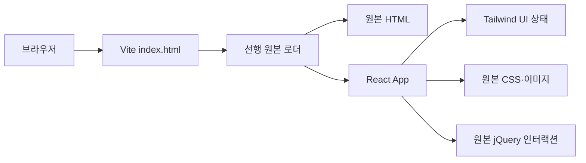

# Architecture & Migration Notes

## 핵심 원칙

이 마이그레이션은 2015년 포트폴리오를 새로 디자인하는 작업이 아닙니다.
기존 디자인, 콘텐츠, 반응형 규칙과 인터랙션을 그대로 유지하면서 개발·빌드
환경만 React와 Vite로 전환합니다.

## 렌더링 흐름

1. Vite의 `index.html`이 React 진입점을 실행합니다.
2. `src/main.jsx`가 `src/legacy.js`를 통해 `/legacy/index.html`을 읽습니다.
3. 원본 마크업의 상대 이미지와 링크 경로를 `/legacy` 기준으로 변환합니다.
4. 브라우저 `load` 전에 변환을 끝내고 React 루트에 동기적으로 렌더링합니다.
5. `src/App.jsx`가 jQuery, scrollTo, Magnific Popup과 원본 `script.js`를 순서대로 로드합니다.
6. React 오류 상태와 신규 UI는 Tailwind CSS 유틸리티로 렌더링합니다.

## 파일 역할

- `index.html`: 메타데이터, 원본 CSS와 React 진입점
- `src/main.jsx`: 원본 마크업 선행 로딩과 React 동기 마운트
- `src/legacy.js`: 원본 문서 로딩과 자산 경로 변환
- `src/App.jsx`: 준비된 원본 화면과 레거시 스크립트 로딩
- `src/tailwind.css`: Tailwind 테마와 유틸리티 진입점
- `public/legacy/index.html`: 화면과 콘텐츠의 기준 원본
- `public/legacy/css/style.css`: 원본 디자인과 반응형 규칙
- `public/legacy/js/script.js`: 원본 스크롤, 슬라이드, 메뉴와 갤러리 동작
- `public/legacy/html`: 포트폴리오에 연결된 개별 작업물
- `public/legacy/images`: 원본 이미지와 갤러리 자산
- `tests`: 스크롤, 자산 경로, 접근성 표식과 문서 메타데이터 회귀 검사

## 시각적 정합성 검증

루트 `/`와 기준 페이지 `/legacy/index.html`을 동일한 브라우저와 해상도에서
캡처해 비교합니다.

- 데스크톱 기준: 1280×720
- 모바일 기준: 390×844
- 초기 화면, Works 이동, 이미지 갤러리 동작 확인

애니메이션이 있는 요소는 동일 시점에 캡처하거나 차이 영역이 해당 애니메이션에
한정되는지 확인합니다.

## 유지보수 원칙

- 원본 요청 없이 레이아웃, 색상, 폰트, 카피를 재설계하지 않습니다.
- 화면 수정은 우선 `public/legacy`의 원본 파일에 반영합니다.
- React 컴포넌트와 새 UI 스타일은 Tailwind 유틸리티를 사용합니다.
- Tailwind 전환은 화면 단위로 진행하고 같은 커밋에서 기존 규칙을 제거합니다.
- 기존 화면 전환이 끝날 때까지 Preflight를 켜지 않습니다.
- 원본 자산 경로를 이동할 때는 `src/legacy.js`의 경로 변환도 확인합니다.
- 배포 전 `npm test`, `npm run lint`, `npm run build`와 원본 비교 검증을 수행합니다.

## 선행 로딩과 스크롤

React가 마운트된 뒤 원본 HTML을 가져오면 브라우저 `load` 직후 문서 높이가
한 화면뿐이어서 사용자의 첫 스크롤 입력이 사라질 수 있습니다. 현재 진입점은
top-level await로 원본 마크업을 먼저 준비하고 `flushSync`로 React를 마운트해,
`load` 시점에 About·Works·Contact를 포함한 전체 문서 높이를 확보합니다.

페이지 준비 이후에는 원본 앵커 애니메이션을 유지하지만 새로고침 시 강제로
상단으로 이동하지 않습니다.

## 모바일 AutoCamping

원본 저장소의 `Web_renew_m`에는 HTML과 CSS만 있고 별도 이미지 폴더가
누락되어 있습니다. 모바일 페이지는 디자인이 같은 데스크톱 AutoCamping의
보존 자산을 상대 경로로 재사용합니다. 자산을 이동하거나 이름을 바꾸면
`tests/polish.test.mjs`가 누락을 감지합니다.

## Tailwind 호환 전략

Tailwind CSS 4는 공식 Vite 플러그인으로 빌드합니다. 현재는 원본의 브라우저
기본값과 reset 규칙을 보존하기 위해 `theme.css`와 `utilities.css`만
가져옵니다. 이 구성은 새 코드를 Tailwind로 작성할 수 있게 하면서 2015년
화면의 픽셀 정합성을 유지합니다.

전환 순서는 React 셸, 공통 레이아웃, 섹션, 반응형 규칙, 플러그인 스타일
순입니다. 각 단계는 1280×720과 390×844 화면 비교 및 메뉴·갤러리 동작 확인을
통과해야 합니다.

## 메타데이터

시각 디자인에 영향을 주지 않는 사이트 메타데이터는 Vite `index.html`에서
관리합니다.

- favicon: `/favicon.png`
- Open Graph/Twitter 이미지: `/legacy/images/responsive.jpg`
- 문서 제목: `PORTFOLIO`
