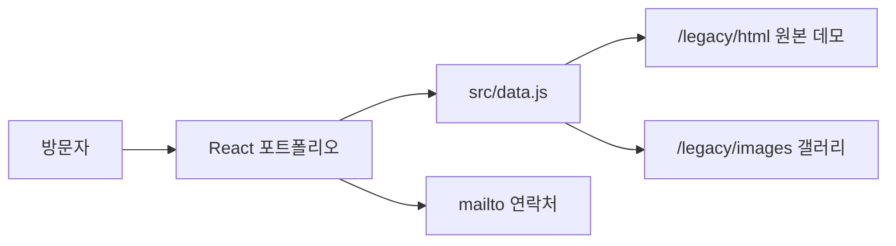

# Architecture & Migration Notes

## 마이그레이션 목표

기존 포트폴리오는 루트 `index.html` 하나에 소개, 작업 목록, 연락처가 모두
작성되어 있었고, jQuery가 스크롤 이동, 슬라이드, 메뉴, 갤러리를 담당했습니다.
이번 마이그레이션의 목표는 다음과 같습니다.

1. 루트 애플리케이션을 React와 Vite 기반으로 전환한다.
2. 2015년 작업물의 역사성과 실행 가능한 데모를 보존한다.
3. 프로젝트 정보와 화면 코드를 분리해 수정 비용을 낮춘다.
4. 마우스뿐 아니라 키보드와 모바일에서도 주요 기능을 사용할 수 있게 한다.
5. 정적 호스팅만으로 배포 가능한 구조를 유지한다.

## 현재 구조

### React 애플리케이션

`src/App.jsx`는 아래 화면 단위 컴포넌트를 포함합니다.

- `Header`: 섹션 내비게이션과 모바일 메뉴
- `Hero`: 포트폴리오 소개
- `About`: 소개, 이력, 강점
- `Work`: 프로젝트 필터와 카드 목록
- `GalleryModal`: 이미지 갤러리
- `Contact`: 이메일 CTA와 원본 사이트 링크

프로젝트 데이터는 `src/data.js`에 분리되어 있습니다. 새 프로젝트는 화면
컴포넌트를 수정하지 않고 이 배열에 항목을 추가하는 방식으로 등록합니다.

### 정적 아카이브

기존 루트의 `css`, `font`, `html`, `images`, `js` 디렉터리와 원본
`index.html`은 `public/legacy`로 이동했습니다. Vite는 `public`의 파일을
가공하지 않고 빌드 결과에 복사하므로 오래된 상대 경로와 jQuery 데모를
그대로 제공할 수 있습니다.

## 상태 관리

외부 상태 관리 라이브러리는 사용하지 않습니다.

- 활성 내비게이션: `IntersectionObserver`와 로컬 state
- 모바일 메뉴: boolean state
- 프로젝트 필터: 선택된 카테고리 state와 `useMemo`
- 갤러리: 선택된 프로젝트와 현재 이미지 index state

현재 규모에서는 이 구성이 가장 단순합니다. 프로젝트 상세 라우트나 CMS가
추가될 때 React Router 또는 서버 데이터 계층을 검토합니다.

## 접근성

- 본문 바로가기 링크 제공
- 모든 이미지에 목적을 설명하는 대체 텍스트 제공
- 내비게이션과 갤러리 버튼에 접근 가능한 이름 제공
- 갤러리에 `dialog`, `aria-modal` 적용
- `Escape`, 왼쪽·오른쪽 방향키 지원
- `prefers-reduced-motion` 사용자의 애니메이션 최소화

갤러리에 복잡한 입력 요소가 추가되는 경우에는 포커스 트랩과 닫힌 뒤의
포커스 복원을 함께 구현해야 합니다.

## 메타데이터와 정적 자산

사이트 공통 SEO와 소셜 공유 메타데이터는 Vite 진입점인 `index.html`에서
관리합니다.

- favicon: `/favicon.png`
- Open Graph/Twitter 이미지: `/legacy/images/responsive.jpg`
- 로컬 웹 폰트: `/legacy/font`

실제 서비스 도메인이 정해지면 `og:url`과 canonical URL을 추가하고,
소셜 공유용 1200×630 이미지를 별도로 제작하는 것을 권장합니다.

## 유지보수 원칙

- 새 React 코드에서 jQuery를 사용하지 않습니다.
- 기존 데모 수정은 `public/legacy` 안에서만 진행합니다.
- 프로젝트 설명과 경로는 `src/data.js`에서 관리합니다.
- 스타일 변경 후 390px 모바일과 1280px 이상 데스크톱을 함께 확인합니다.
- 배포 전 `npm run lint`와 `npm run build`를 모두 실행합니다.
